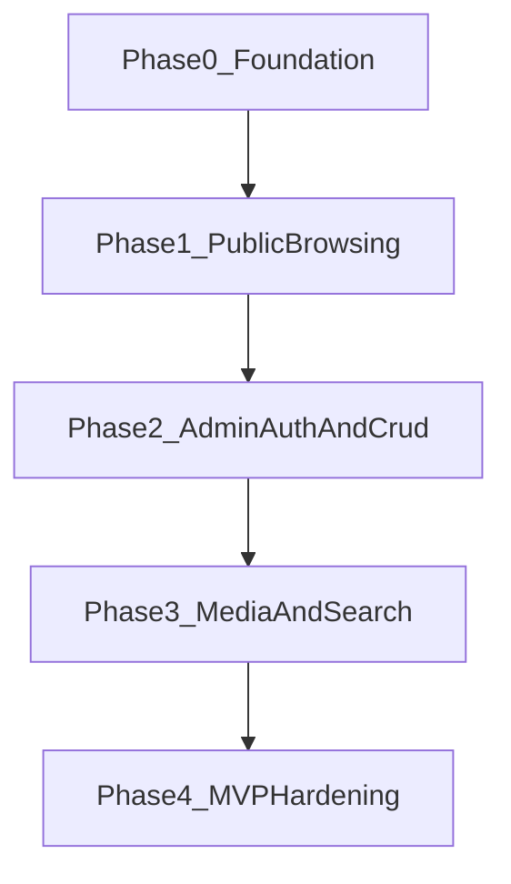

# Phased Functional Specification

## Project Summary

This document converts the source product brief into an implementation-ready phased specification for this repository.

The product is a reusable scrapyard inventory platform. The first branded deployment is for Hybrid Auto Parts in Sun Valley, California, but the system must be structured so it can later support multiple scrapyards with configurable branding and business information.

The target is a production-quality MVP, not a throwaway prototype. The implementation must optimize for maintainability, strong typing across the stack, predictable delivery, and a clear path to future expansion.

## Product Intent

The MVP must let a scrapyard:

- Publish a professional public-facing inventory website.
- Display searchable parts inventory with images and business information.
- Manage parts and branding through a protected admin interface.
- Run the full system locally with seeded data using a single development command.

The MVP must let customers:

- Search for parts.
- Browse inventory.
- View part details.
- Contact the scrapyard.

The MVP must let administrators:

- Authenticate securely.
- Create, edit, and delete parts.
- Upload and order part images.
- Configure company branding and contact information.

## Users And Roles

### Public Customer

Public customers can browse and search inventory, view part details, and contact the scrapyard. They do not authenticate.

### Admin User

Admin users authenticate through protected routes and can manage inventory, images, and branding. Roles are simple in MVP and can begin with a single admin role.

## Guiding Principles

- Build for one scrapyard first without hard-coding business identity into core logic.
- Keep business logic in backend services and keep frontend components presentation-focused.
- Share API contracts through OpenAPI-generated TypeScript models to reduce duplication.
- Ship user-visible value in slices that can be demoed and tested independently.
- Defer advanced marketplace and interchange capabilities until after the MVP is stable.

## In-Scope MVP Capabilities

### Public Site

- Home page with a prominent search experience.
- Inventory listing page with search and pagination.
- Part detail page with vehicle compatibility context and contact call to action.
- About page with business description and location content.
- Contact page with phone, email, address, hours, and map embed support.

### Inventory Management

- Create part records.
- Edit part records.
- Delete part records.
- Change inventory status.
- Attach multiple images to a part.
- Control image display ordering.

### Branding And Company Configuration

- Company name.
- Logo URL.
- Hero image URL.
- Phone number.
- Email address.
- Physical address.
- Business hours.
- Company description.

### Platform Foundations

- Monorepo layout with frontend, backend, shared, and infrastructure areas.
- Docker Compose local development.
- PostgreSQL persistence.
- Seed data and demo admin credentials for local environments.
- Generated frontend types from backend OpenAPI output.

## Explicitly Out Of Scope

The following items must remain deferred and should not be implemented during MVP phases:

- Payments and checkout.
- E-commerce cart flow.
- Interchange search.
- Part compatibility database beyond simple vehicle fields.
- VIN decoding.
- Imports from yard software.
- SMS inquiries.
- Cross-yard marketplace behavior.
- Full multi-tenant tenant isolation.
- Cloud image storage.

## Normalized Functional Requirements

### Inventory Domain

The platform must manage a `Part` entity with at least the following fields:

- `id`
- `title`
- `description`
- `price`
- `condition`
- `vehicleMake`
- `vehicleModel`
- `vehicleYear`
- `category`
- `stockNumber`
- `mileage`
- `grade`
- `yardLocation`
- `createdAt`
- `updatedAt`
- `inventoryStatus`

The platform must manage a `PartImage` entity with at least:

- `id`
- `partId`
- `filePath`
- `displayOrder`

The platform must manage a `CompanyConfig` entity with at least:

- `companyName`
- `logoUrl`
- `heroImageUrl`
- `phone`
- `email`
- `address`
- `hours`
- `description`

The platform must manage an `AdminUser` entity with at least:

- `id`
- `username`
- `passwordHash`
- `role`

### Search

Search must support natural part lookup phrases such as:

- `2015 camry alternator`
- `bmw headlight`
- `ford f150 transmission`

Search relevance must consider:

- `title`
- `description`
- `vehicleMake`
- `vehicleModel`

The MVP should start with a simple searchable listing and then progress to PostgreSQL full text and trigram matching in a later phase.

### Image Handling

Images must be stored on the local filesystem in MVP under an uploads directory and exposed through backend static serving. The design must leave room for future storage abstraction, but no cloud provider integration is required in MVP.

### Admin Security

Admin endpoints must be protected with JWT-based authentication. Passwords must be stored using BCrypt hashing. Public inventory pages must remain accessible without authentication.

## Non-Functional Requirements

### Architecture

- Frontend: React, TypeScript, Vite, Tailwind CSS, shadCN UI, TanStack Query, React Router.
- Backend: Java LTS, Spring Boot, Gradle, Lombok, SLF4J, Spring Data JPA, Spring Security.
- Database: PostgreSQL.
- Infrastructure: Docker and Docker Compose.
- Testing: JUnit 5 for backend, Vitest for frontend.
- Mapping: MapStruct for DTO and entity mapping.

### Repository Layout

The monorepo should use this top-level structure:

- `backend/`
- `frontend/`
- `shared/`
- `infrastructure/`
- `docs/`

### API Contract Strategy

Backend DTOs are the source of truth for API contracts. OpenAPI generation from Spring Boot must feed TypeScript model generation into `shared/api-types/`, and the frontend must import those generated types rather than manually redefining DTOs.

### Local Development

Developers must be able to start the stack with `docker compose up`. The local stack must include:

- `postgres`
- `backend`
- `frontend`

The backend must support:

- automatic migrations
- database seeding
- default admin creation

### Performance

The inventory listing should be designed to load quickly in local development and remain usable with thousands of parts. Pagination and efficient query design are required from the start, even before advanced search tuning.

### Logging

The backend must use structured SLF4J logging for:

- incoming requests
- handled errors
- important business events

### Testing

Each phase must define testable exit criteria. Backend services and controllers must receive JUnit coverage over time, and frontend components and key UI flows must receive Vitest coverage over time. The frontend test plan must also evolve into a reusable regression suite that covers critical public and admin journeys before release hardening is complete.

## Phased Delivery Strategy

## Phase 0: Foundation

### Status

Complete.

### Objective

Establish the monorepo, baseline architecture, local developer workflow, shared API contract generation path, seed strategy, and core domain skeletons without attempting full end-user functionality.

### User Value

This phase creates the delivery foundation. It does not yet provide a complete customer experience, but it enables the team to build every later feature on stable project rails.

### Scope

#### Backend

- Create Spring Boot service skeleton.
- Configure Gradle build.
- Add layered package structure: `controller`, `service`, `repository`, `model`, `dto`, `config`.
- Define initial domain entities and DTOs for `Part`, `PartImage`, `CompanyConfig`, and `AdminUser`.
- Add MapStruct integration.
- Configure PostgreSQL connectivity.
- Add migration framework and seed mechanism.
- Add initial OpenAPI generation.

#### Frontend

- Create React + TypeScript + Vite app.
- Configure Tailwind CSS, shadCN UI, TanStack Query, and React Router.
- Define top-level route structure for public and admin areas.
- Add shared layout shell and design tokens aligned to reusable branding.

#### Shared

- Establish generated type output under `shared/api-types/`.
- Ensure frontend imports generated types from shared output.

#### Infrastructure

- Create Dockerfiles and `docker-compose.yml`.
- Wire `postgres`, `backend`, and `frontend`.
- Define environment variable strategy for local development.

#### Seed Data

- Add sample company configuration.
- Add sample parts.
- Define placeholder strategy for sample images.
- Create default admin credentials for local development only.

#### Testing

- Add backend test harness.
- Add frontend test harness.
- Add smoke-level checks proving apps boot successfully.

### Exit Criteria

- Monorepo structure exists and boots locally with one command.
- Frontend, backend, and database containers start together.
- Backend can connect to PostgreSQL and apply migrations.
- Seed data is available after startup.
- Generated TypeScript models can be produced from backend OpenAPI output.
- Placeholder home route and health endpoints are reachable.

### Deferred From This Phase

- Full public inventory browsing experience.
- Authentication flow.
- Image upload handling.
- Production-grade search relevance.

## Phase 1: Public Inventory Browsing

### Status

Complete.

### Objective

Deliver a usable public website where customers can browse seeded inventory, view part details, and see company information.

### User Value

This is the first customer-visible release. A scrapyard can publicly present inventory online and customers can discover available parts.

### Scope

#### Backend

- Expose public read endpoints for inventory listing.
- Expose public read endpoints for part detail.
- Expose public read endpoint for company configuration.
- Support pagination parameters for inventory listing.
- Implement a simple baseline search over relevant fields.

#### Frontend

- Build `Home` page with hero search and featured inventory area.
- Build `Inventory` page with card grid, pagination controls, and search bar.
- Build `Part Detail` page with vehicle details, condition, and contact call to action.
- Build `About` page using company description and business content.
- Build `Contact` page using company contact data and map embed placeholder.

#### Data And UX

- Display seeded parts with consistent card design.
- Show branding and contact information pulled from configuration.
- Keep navigation mobile-friendly and performance-conscious.

#### Testing

- Add backend tests for public inventory and company endpoints.
- Add frontend tests for core page rendering and search interaction.

### Exit Criteria

- Public users can browse paginated inventory.
- Public users can search inventory with a basic query.
- Public users can view part details.
- Public users can view business information and contact details.
- Public routes work without authentication.

### Deferred From This Phase

- Admin login.
- Inventory editing.
- Multi-image management.
- PostgreSQL full text and trigram search.

## Phase 2: Admin Authentication And Inventory CRUD

### Objective

Enable secure administrator access and basic content management for parts and company branding.

### User Value

This phase turns the public site into an operable business tool by allowing staff to manage inventory and branding without direct database access.

### Scope

#### Backend

- Implement admin authentication endpoint.
- Issue JWT tokens for valid admin credentials.
- Protect admin API routes with Spring Security.
- Implement create, update, delete, and status update operations for parts.
- Implement update operation for company configuration.
- Hash passwords with BCrypt.

#### Frontend

- Build admin login flow.
- Add protected admin route handling.
- Build admin dashboard shell.
- Build inventory manager list view.
- Build create and edit part forms.
- Build delete confirmation flow.
- Build company branding settings form.

#### Validation

- Enforce required fields for parts and branding data.
- Return predictable validation errors for form submission failures.

#### Testing

- Add backend tests for auth and protected CRUD endpoints.
- Add frontend tests for auth guard behavior and form submission flows.

### Exit Criteria

- Admin users can log in with seeded credentials.
- Unauthenticated access to admin routes is blocked.
- Admin users can create, edit, and delete parts.
- Admin users can update company branding and contact data.
- Public site reflects admin-managed inventory and branding changes.

### Deferred From This Phase

- Multi-image upload and ordering.
- Advanced search relevance.
- Thumbnail generation.

## Phase 3: Media And Rich Search

### Objective

Add the inventory presentation and search quality required for a stronger MVP by supporting real image workflows and more capable search behavior.

### User Value

This phase makes listings more credible and easier to discover by improving both visual presentation and search accuracy.

### Scope

#### Backend

- Implement multipart upload handling for part images.
- Store images in filesystem-backed uploads path.
- Serve uploaded images through static endpoints.
- Support image ordering metadata.
- Introduce thumbnail generation or a simplified thumbnail preparation pipeline.
- Upgrade search implementation to PostgreSQL full text plus trigram similarity.

#### Frontend

- Add image upload UI to create and edit part workflows.
- Add image ordering controls.
- Display galleries on part detail pages.
- Improve inventory result presentation when images are available.

#### Data And Operations

- Ensure image paths are associated with parts reliably.
- Preserve display ordering across edits.
- Handle missing images gracefully in public UI.

#### Testing

- Add backend tests for upload handling and search behavior.
- Add frontend tests for gallery rendering and image management flows.

### Exit Criteria

- Admin users can upload multiple images per part.
- Admin users can control image order.
- Public users can view part galleries.
- Public search handles common multi-term part queries more effectively than the baseline phase.
- Uploaded files are served successfully through the application.

### Deferred From This Phase

- Cloud storage.
- AI image processing.
- External search engines.

## Phase 4: MVP Hardening And Release Readiness

### Objective

Harden the platform so the MVP is easier to operate, test, and evolve into a reusable SaaS-oriented codebase.

### User Value

This phase reduces operational risk and improves developer confidence, making the MVP suitable for real business use.

### Scope

#### Backend

- Improve request, error, and business-event logging.
- Tighten validation and error response consistency.
- Review query efficiency and indexing strategy for inventory and search.
- Ensure safe defaults in security and configuration.

#### Frontend

- Improve loading, empty, and error states across public and admin flows.
- Refine responsive behavior and mobile usability.
- Improve admin usability for day-to-day operations.

#### Shared And Infrastructure

- Finalize local development documentation.
- Document environment variables and startup steps.
- Document generated type workflow.
- Stabilize Docker-based setup for new developers.

#### Testing

- Expand JUnit coverage for key services and controllers.
- Expand Vitest coverage for core user journeys.
- Establish a repeatable frontend regression suite for the most important browsing, admin, and content-management flows so later releases can catch UI and routing regressions quickly.
- Add a small release checklist for smoke validation.

### Exit Criteria

- Logging covers requests, errors, and major admin actions.
- Validation and error handling are consistent across major flows.
- Inventory browsing and search remain performant with realistic seeded volume.
- Documentation allows a developer to start the system and understand the architecture.
- The MVP meets the original acceptance criteria for public users, admins, and developers.

### Deferred From This Phase

- Marketplace features.
- Tenant isolation architecture.
- Payment and commerce flows.
- Integrations with external yard systems.

## Cross-Phase Rules

These rules apply across all phases:

- Do not bypass generated API types with hand-written duplicates in the frontend.
- Do not couple UI branding to Hybrid Auto Parts so tightly that reuse becomes difficult.
- Keep protected admin functionality separate from public browsing flows.
- Keep image storage abstract enough that cloud migration remains possible later.
- Prefer additive schema and API evolution that does not require major rewrites between phases.

## Delivery Dependencies

- Phase 1 depends on Phase 0 foundations, seeded data, and public read API scaffolding.
- Phase 2 depends on Phase 1 domain and route structures so admin edits can affect visible public pages.
- Phase 3 depends on Phase 2 CRUD because image workflows attach to managed inventory records.
- Phase 4 depends on all previous phases and focuses on quality, operability, and release readiness.

## Suggested Execution Strategy

The team should treat each phase as a releasable milestone. Work within a phase should generally proceed in this order:

1. Backend contracts and persistence.
2. Shared API type generation.
3. Frontend screens and interactions.
4. Seed data or sample content updates.
5. Tests and documentation for phase exit.

This ordering reduces rework because the frontend can consume stable contracts and seeded data early, while tests and documentation enforce closure before the next phase begins.

## MVP Acceptance Mapping

The original brief defines three top-level success groups. They map to phases as follows:

- Public user outcomes are substantially delivered by Phases 1 and 3.
- Admin outcomes are substantially delivered by Phases 2 and 3.
- Developer experience outcomes begin in Phase 0 and are finalized in Phase 4.

## Final Notes

This phased specification intentionally delays advanced search, image workflows, and hardening until the platform has a stable foundation and a working public/admin core. That sequencing keeps the project buildable, testable, and usable at every stage while preserving the long-term SaaS direction described in the original prompt.
